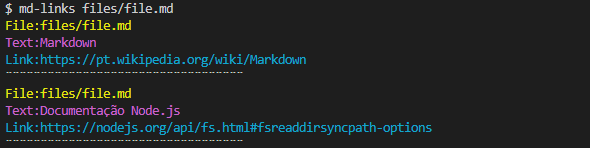
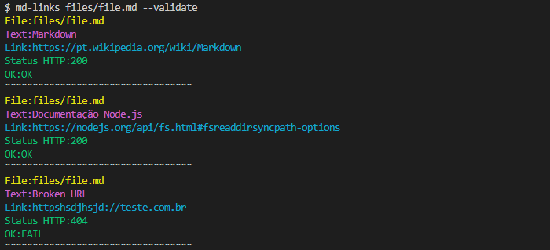
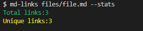
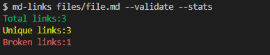
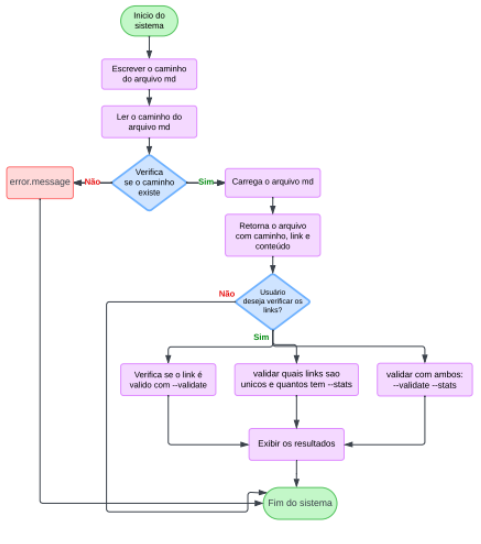

# Markdown Links

## Índice

* [1. Prefácio](#1-prefácio)
* [2. Guia de instalação e uso](#2-guia-de-instalação-e-uso)
* [3. Fluxograma](#3-fluxograma)
* [4. Tecnologias Utilizadas](#4-tecnologias-utilizadas)

***

## 1. Prefácio 🤩

[Markdown](https://pt.wikipedia.org/wiki/Markdown) é uma linguagem de marcação
muito popular entre os programadores. É usada em muitas plataformas que
manipulam texto (GitHub, fórum, blogs e etc) e é muito comum encontrar arquivos
com este formato em qualquer repositório (começando pelo tradicional
`README.md`).

O Objetivo deste projeto é desenvolver uma biblioteca que lê arquivos Markdown através de uma CLI (command-line interface) que possiblita a execução da biblioteca no terminal, a partir de um módulo do Node.js, no qual, este irá fazer a leitura dos arquivos em formato `Markdown('.md')`, verificando a existência de links e estatisticas que nele existem.

## 2. Guia de instalação e uso ✅

Instale a biblioteca no terminal através do comando: <strong>`npm install md-links-nicole-tsingas`</strong>

Após a instalação, certifique de ter um arquivo <strong>.md com links</strong> dentro.

 

1. Rode o comando <strong>`mdlinks` + o caminho do seu arquivo </strong>, e será retornado o caminho, text e o link do arquivo seleciondao. Veja o exemplo abaixo:  

     

2. Se você deseja validar os links desse arquivo, utilize a propriedade <strong>--validade</strong>, esta fará uma requisição HTTP e retornará o status e ok do seu link.  
Comando:  
`md-links <caminho-do-arquivo> --validate`.  
 Veja o exemplo abaixo:

    

3. Se você deseja verificar as estatistiscas dos links desse arquivo, utilize a propriedade <strong>--stats</strong>, esta retornará o total de links encontrados no arquivo e quais desses são unicos.  
Comando:  
`md-links <caminho-do-arquivo> --stats`.  
 Veja o exemplo abaixo:

    

4. Se você deseja verificar as estatistiscas e validar os links desse arquivo, utilize a propriedade <strong>--validade --stats</strong>, esta retornará o total de links encontrados no arquivo, quais desses são unicos e quais estão quebrados.  
Comando:  
`md-links <caminho-do-arquivo> --validate --stats`.  
 Veja o exemplo abaixo:
 
    

## 3. Fluxograma 📝
Fluxograma do projeto

## 4. Tecnologias Utilizadas 🚀

     
